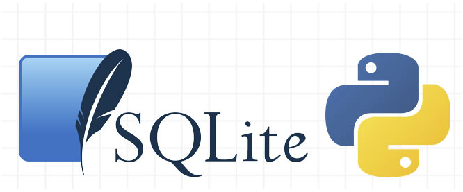

#  Py-SQL

## PostgreSQL-Python

https://www.psycopg.org/

## SQLAlchemy

https://www.pythonsheets.com/notes/python-sqlalchemy.html

## SQLite

https://www.sqlite.org/index.html

### Creating Database
### Creating Tables
### insering-importing Data into Database
### Performing queries
